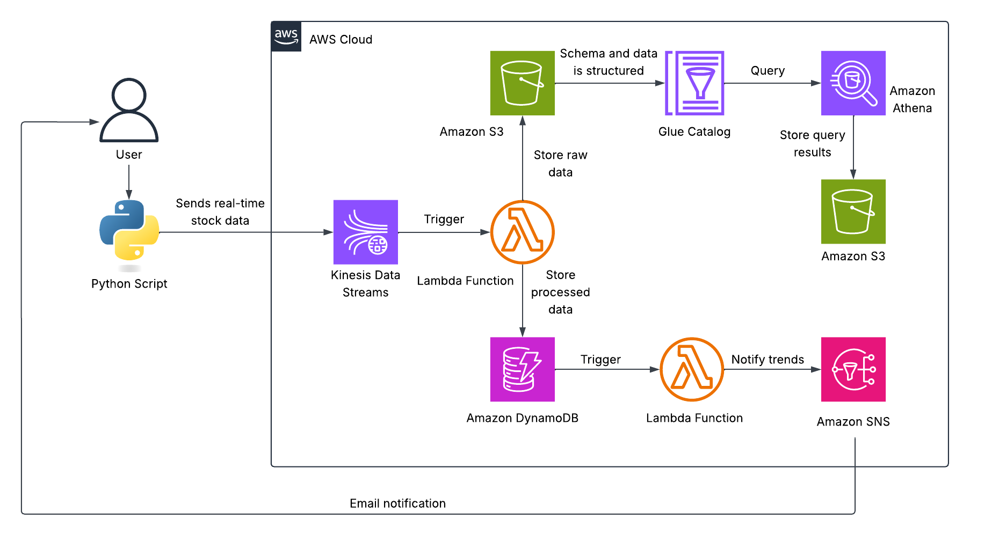
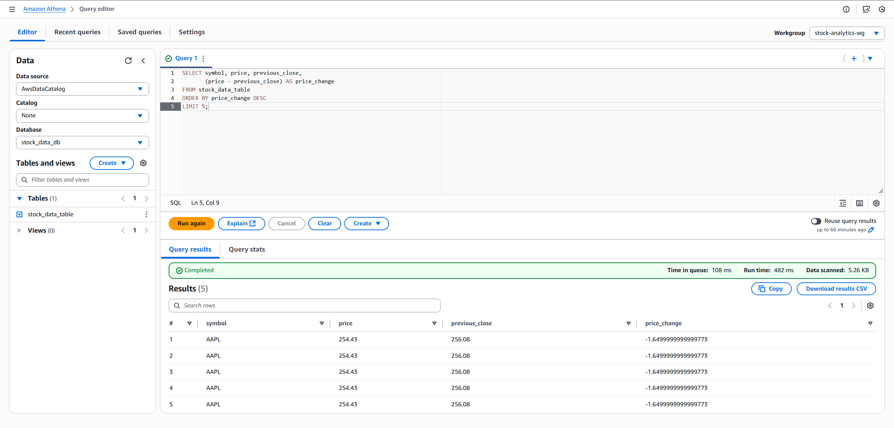
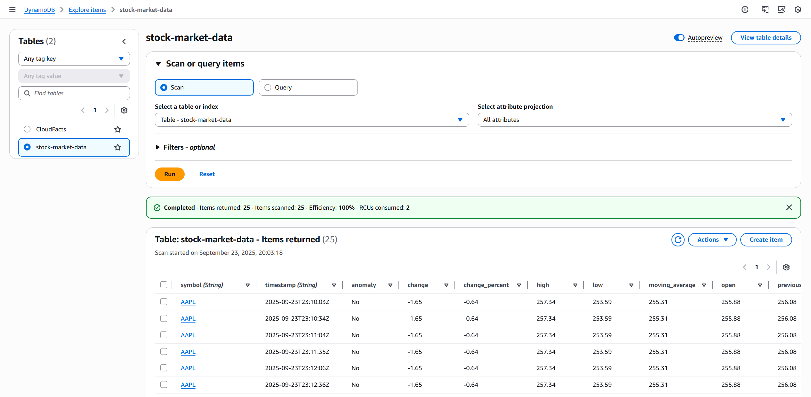
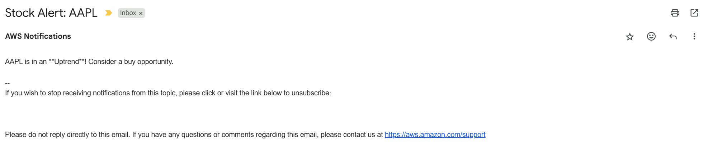

# AWS Stock Market Analytics Pipeline
A near real-time, event-driven analytics pipeline on AWS that ingests live stock ticks (default **AAPL**) via **Amazon Kinesis Data Streams**, processes them with **AWS Lambda**, stores **raw** JSON in **Amazon S3** for historical analysis, persists **processed** records in **Amazon DynamoDB** for low-latency lookups, and surfaces insights with **AWS Glue + Amazon Athena**. A second Lambda performs **trend analysis** (SMA-5 vs SMA-20) and publishes **buy/sell alerts** through **Amazon SNS** (email). The stream script uses a **30-second delay** to keep costs low while remaining near real-time.  

**Trend logic (Analysis Lambda via SNS)**:
- SMA-5: Short-term moving average over last 5 records.  
- SMA-20: Long-term moving average over last 20 records.  
- Uptrend: SMA-5 crosses above SMA-20 → BUY alert.  
- Downtrend: SMA-5 crosses below SMA-20 → SELL alert.  

## Architecture Overview
  
*Figure 1: Architecture diagram of the Stock Market Analytics Pipeline.*  

- **Amazon Kinesis Data Streams** – Ingests streaming stock ticks from the producer script.  
- **AWS Lambda (Processing)** – Transforms events from Kinesis, writes raw JSON to S3 and processed items to DynamoDB.  
- **Amazon S3** – Stores raw event data and Athena query results in dedicated buckets.  
- **AWS Glue Data Catalog** – Registers the raw JSON schema for SQL access via Athena.  
- **Amazon Athena** – Queries historical stock data serverlessly; Workgroup is configured with the results bucket.  
- **Amazon DynamoDB** – Holds processed records for low-latency querying, with a stream to trigger analysis.  
- **AWS Lambda (Analysis)** – Queries recent data, computes SMA-5/SMA-20, detects crosses, and publishes alerts.  
- **Amazon SNS** – Sends real-time BUY/SELL alerts to email/SMS subscribers.  
- **AWS IAM** – Enforces least-privilege access for Lambda to Kinesis, DynamoDB, S3, Glue, and SNS.  
- **Amazon CloudWatch Logs** – Captures Lambda logs for troubleshooting and observability.  

## Skills Applied
- Designing an **event-driven architecture** with decoupled producers/consumers.  
- Implementing serverless data processing with **AWS Lambda** triggered by **Kinesis**.  
- Streaming market data and buffering ingestion through **Kinesis Data Streams**.  
- Persisting processed entities in **Amazon DynamoDB** with a composite key for query efficiency.  
- Storing immutable raw data in **Amazon S3** to enable replay and downstream analytics.  
- Modeling a **Glue Data Catalog** table for semi-structured JSON and Athena access.  
- Querying historical trends with **Amazon Athena** and a dedicated **Workgroup** output location.  
- Detecting momentum changes via **SMA-5/SMA-20** crosses in a Lambda consumer.  
- Publishing real-time notifications through **Amazon SNS** (email).  

## Features
- **Near Real-Time Streaming** — Ingests ticks continuously with a configurable 30-second cadence.  
- **Dual Storage Pattern** — **Raw** JSON in S3 for analytics; **Processed** items in DynamoDB for fast reads.  
- **Trend Detection** — Computes **SMA-5/SMA-20** and emits **BUY/SELL** signals on crosses.  
- **Serverless & Scalable** — Fully managed ingestion, processing, storage, and query layers.  
- **SQL over JSON** — Query raw S3 data via **Glue + Athena** without provisioning clusters.  
- **Actionable Alerts** — Sends real-time **SNS** notifications to subscribers.  

## Tech Stack
- **Languages:** Python 3.13 
- **AWS Services:** Kinesis Data Streams, Lambda, DynamoDB (+ Streams), S3, Glue Data Catalog, Athena, SNS, IAM, CloudWatch Logs
- **IaC Tool:** AWS SAM
- **Other Tools:** AWS CLI  

## Deployment Instructions
> **Note:** All command-line examples use `bash` syntax highlighting to maximize compatibility and readability. If you are using PowerShell or Command Prompt on Windows, the commands remain the same but prompt styles may differ.  

### **SAM**
1. Clone this repository.  

2. Navigate to the `cloudformation` folder, build, and deploy:  

   ```bash
   cd cloudformation
   sam build
   sam deploy --guided --capabilities CAPABILITY_NAMED_IAM
   ```
3. Provide parameters when prompted (email to subscribe to SNS alerts).  

4. Confirm the SNS subscription from your email inbox.  
 
**Note:** Ensure the AWS CLI is configured (aws configure) with credentials that have sufficient permissions to manage **S3**, **Kinesis Data Streams**, **Lambda**, **DynamoDB**, **Athena**, **SNS**, and **IAM resources**.  

## How to Use
1. **Deploy the infrastructure** using SAM.  

2. **Install Python 3.13** if not already installed.  

3. **Install required Python libraries**:  
	```bash
	pip install boto3 yfinance
	```
4. ***(Optional)* Configure the stream script**: Open `src/stream_function/stream_stock_data.py` and set the `STREAM_NAME`, `STOCK_SYMBOL`, and `DELAY_TIME` variables to customize the application.  

5. **Run the streaming producer script**:  
   ```bash
   python src/stream_function/stream_stock_data.py
   ```
   
6. **Observe the pipeline**:
	- **Kinesis Data Stream**: Every 30 seconds, data flows into the Kinesis Data Stream `stock-market-stream`.  
	- **S3 (raw)**: `s3://stock-market-data-bucket-<account-id>/raw-data/<symbol>/...json`  
	- **DynamoDB (processed)**: `stock-market-data` table updates in real time.  
	- **SNS Alerts**: Email notifications for **BUY/SELL** signals.  
	- **Athena**: Database `stock_data_db`, table `stock_data_table` (Workgroup `stock-analytics-wg`).  
		- **Sample Athena queries**:  
		  ```sql
		  -- Quick peek
		  SELECT * FROM stock_data_table LIMIT 10;
		
		  -- Top 5 by absolute price change
		  SELECT symbol, price, previous_close,
          (price - previous_close) AS price_change
		  FROM stock_data_table
		  ORDER BY price_change DESC
		  LIMIT 5;
		
		  -- Average trading volume per symbol
		  SELECT symbol, AVG(volume) AS avg_volume
		  FROM stock_data_table
		  GROUP BY symbol;
		
		  -- Anomalies (|percent change| > 5%)
		  SELECT symbol, price, previous_close,
          ROUND(((price - previous_close) / previous_close) * 100, 2) AS change_percent
		  FROM stock_data_table
		  WHERE ABS(((price - previous_close) / previous_close) * 100) > 5;
		  ```
		
## Project Structure
```plaintext
aws-stock-market-analytics-pipeline
├── assets/                          	  # Images, diagrams, screenshots
│   ├── architecture-diagram.png          # Project architecture diagram
│   ├── athena-screenshot.png          	  # Athena screenshot
│   ├── dynamodb-screenshot.png           # DynamoDB screenshot
│   └── notification-screenshot.png       # Email notification screenshot
├── cloudformation/                       # AWS SAM template
│   └── template.yaml                     # Main SAM template
├── src/                              	  # Lambda source code
│   └── analysis_function/                # Analysis Lambda
│       └── analysis_lambda.py
│   └── processing_function/              # Processing Lambda
│       └── processing_lambda.py
│   └── stream_function/	              # Streaming producer
│       └── stream_stock_data.py   
├── LICENSE
├── README.md
└── .gitignore
```

## Screenshots


*Figure 2: Trend Analysis with Amazon Athena.*  



*Figure 3: Stock Market Data Stored within DynamoDB.*  



*Figure 4: Stock Alert Email Notification.*  

## Future Enhancements
- **Parquet + Partitioning** – Convert raw JSON to **Parquet**, partition by **symbol/date** to speed Athena queries and reduce costs.  
- **QuickSight Dashboard** – Visualize SMA crosses, intraday volume, and price bands with **Amazon QuickSight**.  
- **API Access** – Add **API Gateway + Lambda** for RESTful access to recent ticks or signals.  
- **SageMaker Anomaly Detection** – Explore ML-based drift/anomaly detection on streaming features.  
- **EventBridge Scheduling** – Periodically trigger deeper analyses or batch enrichments.  
- **Secrets & Config** – Store API keys and variables in **AWS Secrets Manager** or **SSM Parameter Store**.  
- **DLQs & Destinations** – Add **SQS DLQ** and **Lambda Destinations** for failure handling and replay.  
- **Multi-Symbol Portfolios** – Expand producer to multiple symbols and portfolio-level alerts.  

## License
This project is licensed under the [MIT License](LICENSE).  

---

## Author
**Patrick Heese**  
Cloud Administrator | Aspiring Cloud Engineer/Architect  
[LinkedIn Profile](https://www.linkedin.com/in/patrick-heese/) | [GitHub Profile](https://github.com/patrick-heese)  

## Acknowledgments
This project was inspired by a course from [techwithlucy](https://github.com/techwithlucy).  
The Lambda function is adapted directly from the author's original implementation (environment variables added for portability).  
The architecture diagram included here is my own version, adapted from the original course diagram.  
I designed and developed all Infrastructure-as-Code (SAM) and project documentation.  
